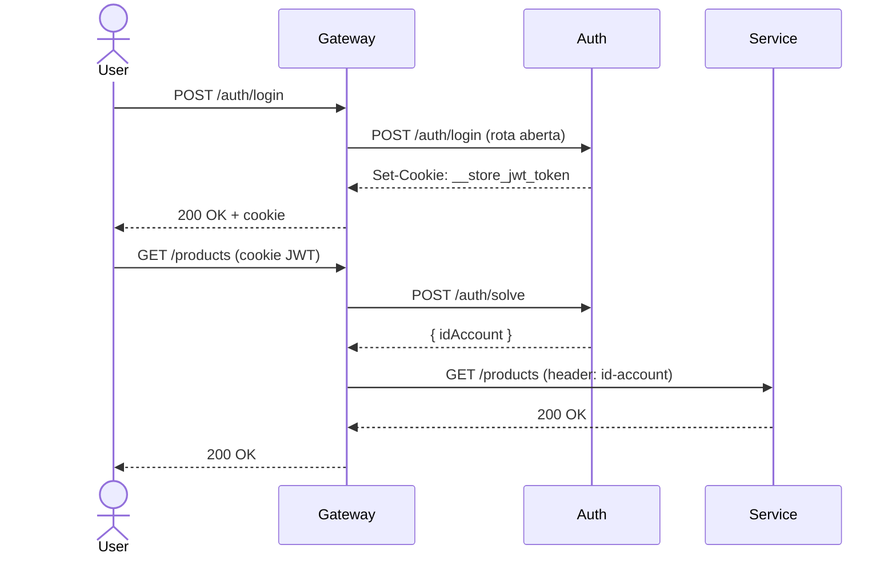
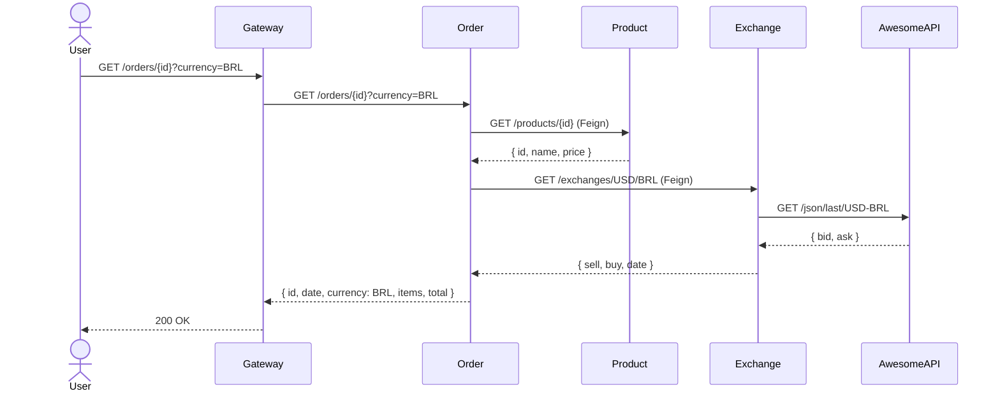

# Arquitetura

## Visão geral

A plataforma segue o padrão de **API Gateway + Trusted Layer**. Todo tráfego externo passa pelo gateway, que valida o JWT antes de encaminhar para os serviços internos.

```mermaid
graph LR
    internet([Internet]) -->|HTTP| gateway

    subgraph trusted[Trusted Layer]
        gateway -->|/accounts/**| account
        gateway -->|/auth/**| auth
        gateway -->|/products/**| product
        gateway -->|/orders/**| order
        gateway -->|/exchanges/**| exchange

        auth -->|valida JWT| gateway
        account --> db[(PostgreSQL\nschemas: accounts)]
        product --> db2[(PostgreSQL\nschemas: products)]
        order --> db3[(PostgreSQL\nschemas: orders)]
    end

    order -->|OpenFeign\n/products/{id}| product
    order -->|OpenFeign\n/exchanges/{from}/{to}| exchange
    exchange -->|HTTP| awesomeapi([AwesomeAPI])
```

## Fluxo de autenticação



## Fluxo de criação de pedido com câmbio



## Stack técnica

| Serviço | Linguagem | Framework | Banco |
|---------|-----------|-----------|-------|
| gateway-service | Java 25 | Spring Cloud Gateway | — |
| auth-service | Java 25 | Spring Boot 4.0.3 | PostgreSQL |
| account-service | Java 25 | Spring Boot 4.0.3 | PostgreSQL |
| product-service | Java 25 | Spring Boot 4.0.3 | PostgreSQL |
| order-service | Java 25 | Spring Boot 4.0.3 | PostgreSQL |
| exchange | Python 3.13 | FastAPI | — (AwesomeAPI) |

## Infraestrutura

- **Orquestração:** Kubernetes (EKS na AWS)
- **CI/CD:** Jenkins + Docker Hub
- **Banco de dados:** PostgreSQL (RDS ou deployment k8s)
- **Observabilidade:** Prometheus + Grafana
