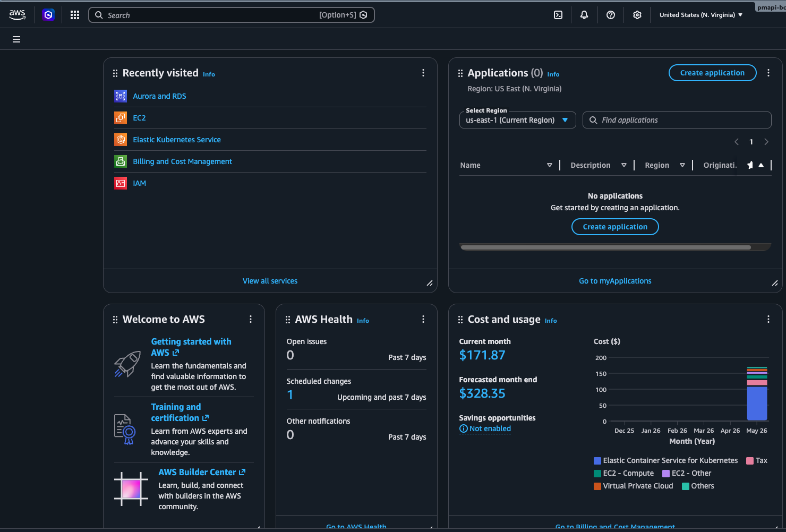

# Custos & SLA

Custos reais para a configuração definida em `infra/eks/cluster.yaml`,
em `us-east-1`. A justificativa de PaaS (por que EKS+RDS em vez de
alternativas mais baratas) está em [PaaS](paas.md).

## Custo por hora (cluster up)

| Recurso | Configuração | $/h |
|---|---|---|
| EKS Control Plane | 1 cluster | 0.10 |
| EC2 NodeGroup | 2x t3.medium on-demand | 0.083 |
| NLB (nginx-ingress) | 1 Network Load Balancer | 0.025 |
| RDS Postgres | db.t3.micro single-AZ, 20GB | 0.017 |
| **Total** | | **~0.225/h** |

## Custo de demo

Cluster fica up apenas durante a janela de demo (~30 min).

- Custo estimado por apresentação: **~$0.12**
- `infra/scripts/teardown.sh` roda imediatamente depois
- AWS Budget Alert em $5/mês como rede de segurança

## Custo se 24/7 (referencial)

| Cenário | Custo/mês |
|---|---|
| Sempre ligado (~$0.225/h x 730h) | ~$165 |
| Cluster + RDS Multi-AZ (HA produção) | ~$220 |
| Free tier não cobre EKS — só RDS db.t3.micro 750h/mês no 1º ano | — |

## Análise real — AWS Cost and Usage

Durante o desenvolvimento, o cluster ficou up por janelas mais longas
(7+ dias contínuos em uma das semanas) para iterar nos deploys e validar
o stress test. O custo observado no console AWS:

| Métrica | Valor |
|---|---|
| Custo mês atual (parcial) | **$171.87** |
| Projeção fim de mês | **$328.85** |

### Composição (observada no widget "Cost and usage" do Console)

| Serviço | Cor no gráfico |
|---|---|
| **Elastic Container Service for Kubernetes (EKS)** | azul — dominante |
| **EC2 — Compute** (worker nodes) | verde |
| **EC2 — Other** (volumes EBS, IPs públicos, transfer) | roxo |
| **Virtual Private Cloud** (NAT, etc.) | laranja |
| **Tax** | imposto sobre tudo |
| **Others** | resto |

<figure markdown="span">
  { width="100%" }
  <figcaption>Figura 1 — Widget "Cost and usage" do Console AWS: custo atual e projeção mensal, com breakdown por serviço (EKS dominante).</figcaption>
</figure>

### Conclusão

O custo escala diretamente com o tempo de cluster up — não com requisições.
Por isso a estratégia: **destruir o cluster fora das janelas de uso**
(`teardown.sh`) e ressurgir antes da próxima sessão (`bootstrap.sh`, ~10 min).
A grande maioria do custo é fixo (EKS control plane + 2× t3.medium 24/7),
não variável por tráfego.

## SLA esperado (publicado pela AWS)

| Componente | SLA AWS | Impacto |
|---|---|---|
| EKS Control Plane | [99.95%](https://aws.amazon.com/eks/sla/) | API server sempre disponível |
| RDS Single-AZ | [99.5%](https://aws.amazon.com/rds/sla/) | sem failover automático — risco assumido pra reduzir custo |
| RDS Multi-AZ | 99.95% | upgrade quando produção real |
| NLB | [99.99%](https://aws.amazon.com/elasticloadbalancing/sla/) | entry point altamente disponível |
| Compose de tudo (P × disponibilidade) | ~99.4% | aceitável pra MVP de aula |

## Otimizações possíveis (não aplicadas)

- **Spot Instances** para o NodeGroup: -60% no custo de EC2, com risco de
  preempção (não vale para demo curta — vale para staging persistente).
- **t4g.medium (Graviton)** ao invés de t3.medium: -10% e melhor perf/$
  para Java 25 (que tem suporte ARM nativo). Imagens Docker já são
  multi-arch (`--platform=linux/arm64,linux/amd64`).
- **ElastiCache Redis** ao invés de pod: maior disponibilidade, mas
  +$0.017/h. Não vale pro caso de aula.
- **EKS Auto Mode** (recente): substitui NodeGroup manual por escala
  gerenciada pela AWS. Reduz tempo de bootstrap, mas custo similar.
