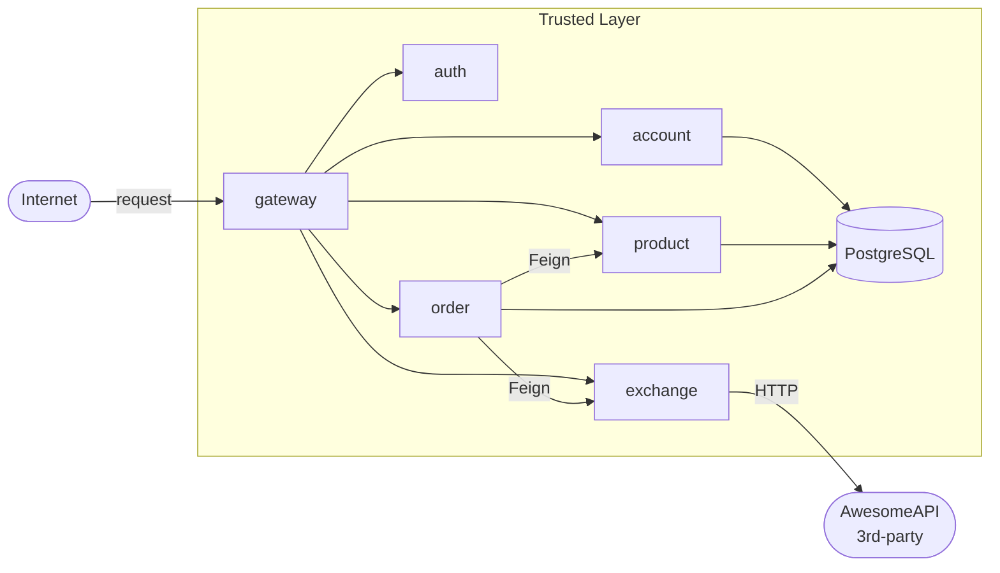

# Store Platform

**Grupo:** Alex Chequer, Carlos, Lucas  
**Disciplina:** Plataformas, Microserviços, DevOps e APIs — Insper 2026.1  
**Instrutor:** Humberto Sandmann

---

## Sobre o projeto

Aplicação web de e-commerce com arquitetura de microserviços. Os usuários podem comprar e vender produtos em múltiplas moedas. A plataforma é composta por seis serviços independentes, orquestrados via Kubernetes (EKS) e integrados por um API Gateway.

## Membros e responsabilidades

| Membro | Microserviço | Repositório |
|--------|-------------|-------------|
| Alex Chequer | Exchange API (Python/FastAPI) | [exchange](https://github.com/Microservice-Alex-Carlos-Lucas/exchange) |
| Carlos | Product API (Java/Spring Boot) | [product-service](https://github.com/Microservice-Alex-Carlos-Lucas/product-service) |
| Lucas | Order API (Java/Spring Boot) | [order-service](https://github.com/Microservice-Alex-Carlos-Lucas/order-service) |

## Repositórios

| Serviço | Repositório |
|---------|-------------|
| Plataforma (raiz) | [microservices](https://github.com/Microservice-Alex-Carlos-Lucas/microservices) |
| Exchange API | [exchange](https://github.com/Microservice-Alex-Carlos-Lucas/exchange) |
| Product API | [product-service](https://github.com/Microservice-Alex-Carlos-Lucas/product-service) |
| Order API | [order-service](https://github.com/Microservice-Alex-Carlos-Lucas/order-service) |
| Account Service | [account-service](https://github.com/Microservice-Alex-Carlos-Lucas/account-service) |
| Auth Service | [auth-service](https://github.com/Microservice-Alex-Carlos-Lucas/auth-service) |
| Gateway Service | [gateway-service](https://github.com/Microservice-Alex-Carlos-Lucas/gateway-service) |

## Status de entrega

| Tarefa | Peso | Status |
|--------|------|--------|
| API Gateway | 5% | ✅ Concluído |
| Auth | 5% | ✅ Concluído |
| Account | 5% | ✅ Concluído |
| Exchange API | 5% | ✅ Concluído |
| Bottlenecks (todos os 6 implementados + medidos) | 20% | ✅ Concluído |
| AWS | 5% | ✅ Conta ativa, IAM user `cluster-admin`, Budget Alert configurado |
| EKS | 10% | ✅ Cluster `store-cluster` provisionado (us-east-1), 2× t3.medium, RDS + nginx-ingress + Redis |
| CI/CD (Jenkins) | 10% | ✅ 8 pipelines verdes com Build + Push + Deploy to EKS |
| Load Testing | 15% | ✅ k6 + HPA validados, scripts em `scripts/k6/` |
| Custos & PaaS & SLA | 10% | ✅ Documentado em [Custos & SLA](costs.md) + [PaaS](paas.md) |
| MkDocs | 10% | ✅ 4 sites publicados (parent + exchange + order + product) |

!!! info "Reprodução por terceiros"
    Pra reproduzir o cluster do zero é necessário ter credenciais AWS válidas
    em `infra/.env` (template em `infra/.env.example`). Depois é só rodar
    `bash infra/scripts/bootstrap.sh` (~10 min) e `bash infra/scripts/deploy-all.sh`.
    O `.env` é `gitignored` por padrão — credenciais nunca saem da máquina do operador.

## Arquitetura geral

