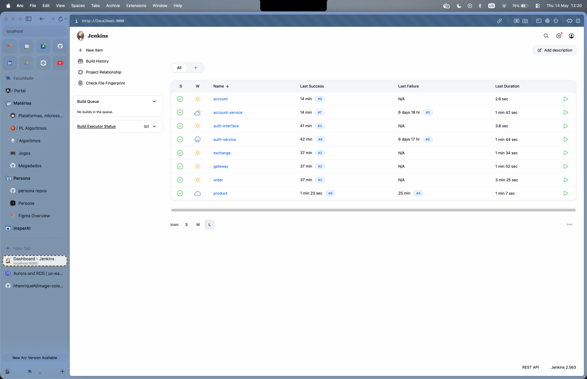
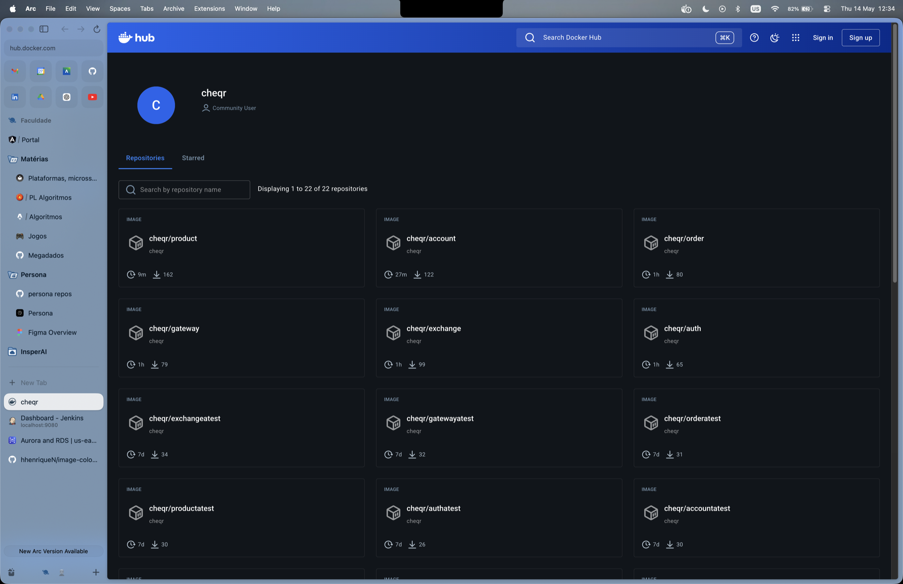

# CI/CD

A plataforma usa **Jenkins** para CI/CD. Cada serviço tem seu próprio `Jenkinsfile` na raiz
do repositório, seguindo o mesmo padrão de pipeline.

## Pipeline padrão (Java/Spring Boot)

```groovy
pipeline {
    agent any
    environment {
        SERVICE = '<nome>'
        NAME    = "cheqr/${env.SERVICE}"
    }
    stages {
        stage('Build') {
            steps { sh 'mvn -B -DskipTests clean package' }
        }
        stage('Build & Push Image') {
            steps {
                withCredentials([usernamePassword(credentialsId: 'dockerhub-credential', ...)]) {
                    sh "docker buildx build --platform=linux/arm64,linux/amd64 --push ..."
                }
            }
        }
    }
}
```

## Pipeline Exchange (Python/FastAPI)

Sem etapa Maven — apenas build e push da imagem Docker:

```groovy
pipeline {
    agent any
    environment {
        SERVICE = 'exchange'
        NAME    = "cheqr/${env.SERVICE}"
    }
    stages {
        stage('Build & Push Image') { ... }
    }
}
```

## Serviços e imagens Docker Hub

| Serviço | Imagem Docker Hub |
|---------|------------------|
| account-service | `cheqr/account:latest` |
| auth-service | `cheqr/auth:latest` |
| gateway-service | `cheqr/gateway:latest` |
| exchange | `cheqr/exchange:latest` |
| product-service | `cheqr/product:latest` |
| order-service | `cheqr/order:latest` |

## Jenkins local

```bash
cd jenkins/
docker compose up -d
# Acesse http://localhost:9080
```

### Dashboard — 8 jobs verdes

Cada job representa um pipeline independente (8 no total: 6 services + 2
libs/interfaces `account` e `auth-interface`):

<figure markdown="span">
  
  <figcaption>Figura 1 — Dashboard do Jenkins com os 8 jobs em estado verde (sucesso). Cada job mapeia 1 pra 1 com um repositório no GitHub.</figcaption>
</figure>

### Vídeo de um pipeline rodando do início ao fim

Pipeline completo do `exchange` (Build → Push Image → Deploy to EKS).
Gravado em `docs/evidence/screenshots/jenkins-video.mov` localmente (112 MB,
gitignored — não embarcado no site nem no repo por causa do limite de 100 MB
do GitHub). Apresentado durante a entrega.

!!! tip "Stage View do pipeline (a capturar)"
    Print da tela de Stage View de um build (mostrando os 4 estágios
    `Dependecies → Build → Build & Push Image → Deploy to EKS` em verde)
    será adicionado aqui após gravação.

## Docker Hub — imagens publicadas

Cada build do Jenkins publica `cheqr/<service>:latest` e `cheqr/<service>:<BUILD_ID>`
(multi-arch `linux/amd64,linux/arm64`):

<figure markdown="span">
  
  <figcaption>Figura 2 — Repositórios `cheqr/*` no Docker Hub: 6 imagens dos services (`account`, `auth`, `exchange`, `gateway`, `order`, `product`) com pushes recentes do Jenkins.</figcaption>
</figure>
