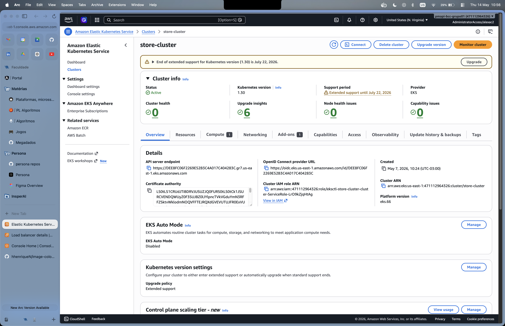
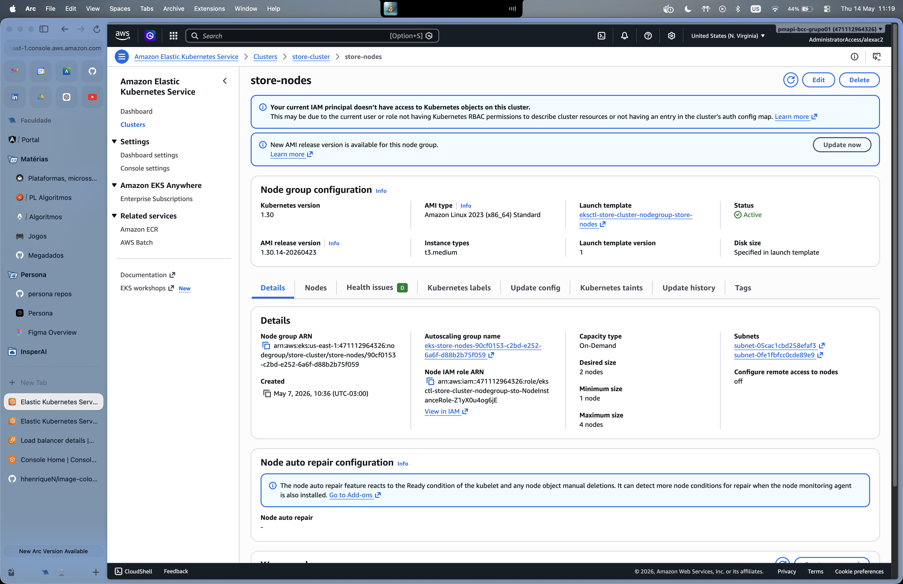
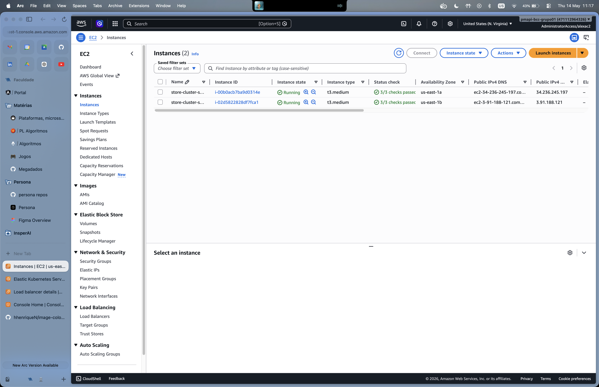

# EKS

Cluster Kubernetes gerenciado pela AWS, definido em `infra/eks/cluster.yaml`
e provisionado via `eksctl`.

## Spec (`infra/eks/cluster.yaml`)

- Cluster name: `store-cluster`
- Version: 1.30
- Region: `us-east-1`
- NodeGroup: 2× **t3.medium** (desired=2, min=1, max=4)
- OIDC habilitado (necessário pra IRSA futuro)

### Cluster ativo no console AWS



### Node group `store-nodes`

Configuração do node group gerenciado (mesma da spec acima):



### Instâncias EC2 (worker nodes)

Os 2 nodes EC2 que compõem o cluster, em AZs diferentes (`us-east-1a` e `us-east-1b`):



## Provisionamento

```bash
# 1. Criar cluster (~10 min)
infra/scripts/bootstrap.sh
# que executa:
#   eksctl create cluster -f infra/eks/cluster.yaml
#   aws eks update-kubeconfig --region us-east-1 --name store-cluster
#   kubectl apply -f https://github.com/kubernetes-sigs/metrics-server/...
#   helm install ingress-nginx ingress-nginx/ingress-nginx -f infra/eks/nginx-ingress-values.yaml
#   kubectl apply -f infra/redis/

# 2. Provisionar RDS (~5 min, depende do VPC criado pelo eksctl)
infra/rds/create-instance.sh

# 3. Atualizar DATABASE_HOST nos ConfigMaps com o endpoint impresso, e:
infra/scripts/deploy-all.sh
```

Final: `kubectl get pods -A` deve mostrar todos os pods `Running`:

```
NAMESPACE       NAME                              READY   STATUS    RESTARTS   AGE
default         account-...                       1/1     Running   0          1m
default         auth-...                          1/1     Running   0          1m
default         exchange-...                      1/1     Running   0          1m
default         gateway-...                       1/1     Running   0          1m
default         order-...                         1/1     Running   0          1m
default         product-...                       1/1     Running   0          1m
default         redis-...                         1/1     Running   0          1m
ingress-nginx   ingress-nginx-controller-...      1/1     Running   0          1m
kube-system     metrics-server-...                1/1     Running   0          1m
```

## Ingress + entry point

`nginx-ingress-controller` é instalado via Helm com `Service type=LoadBalancer +
nlb` annotation. AWS provisiona um **Network Load Balancer** automaticamente.
O DNS do NLB é o entry point externo:

```bash
kubectl get svc -n ingress-nginx ingress-nginx-controller \
    -o jsonpath='{.status.loadBalancer.ingress[0].hostname}'
```

`api/gateway-service/k8s/ingress.yaml` declara `ingressClassName: nginx` e
roteia `/(.*)` → `gateway:8080`. Resultado: `http://<NLB-DNS>/health-check` →
gateway → services internos.

## HPA (demo de carga)

```bash
kubectl get hpa
# NAME      REFERENCE            TARGETS    MINPODS  MAXPODS  REPLICAS
# gateway   Deployment/gateway   1%/50%     1        5        1

# Disparar carga (ver docs/load-testing.md)
k6 run -e BASE_URL=http://<NLB-DNS> -e TOKEN=$TOKEN scripts/k6/gateway-stress.js

# Em outra janela, ver escala:
watch -n 1 'kubectl get hpa,pods -l app=gateway'
```

## Teardown

```bash
infra/scripts/teardown.sh
# eksctl delete cluster --wait      (deleta também o NLB do nginx-ingress)
# aws rds delete-db-instance        (com --skip-final-snapshot)
```

⚠️ **ELBs orfãs custam mesmo sem cluster.** Sempre confirmar no console
AWS após teardown que não ficou nenhum LB de fora.
