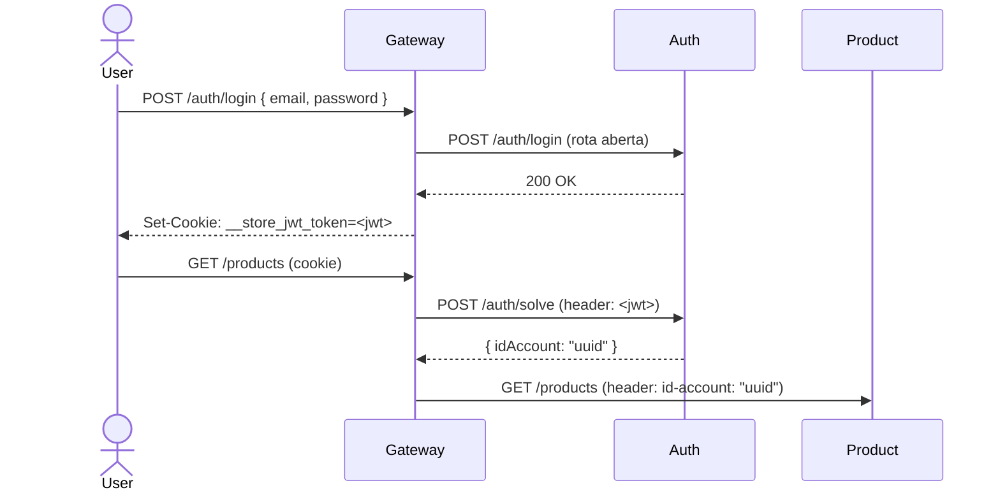

# Auth Service

**Repositório:** [Microservice-Alex-Carlos-Lucas/auth-service](https://github.com/Microservice-Alex-Carlos-Lucas/auth-service)

---

## Descrição

Responsável por emissão e validação de tokens JWT. Usado pelo gateway no filtro de autorização.

## Endpoints-chave

| Rota | Descrição |
|------|-----------|
| `POST /auth/login` | Autentica usuário, retorna cookie `__store_jwt_token` |
| `POST /auth/register` | Cria conta de usuário |
| `POST /auth/solve` | Valida JWT e retorna `{ idAccount }` — chamado internamente pelo gateway |

!!! info "Rotas abertas"
    `/auth/login`, `/auth/register` e `/auth/health-check` não requerem autenticação prévia.

## Fluxo JWT

## Stack

| Item | Detalhe |
|------|---------|
| Linguagem | Java 25 |
| Framework | Spring Boot 4.0.3 |
| Token | JWT (cookie HTTP-only) |
